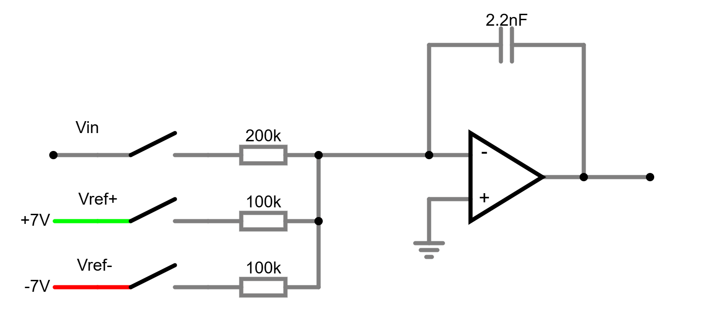
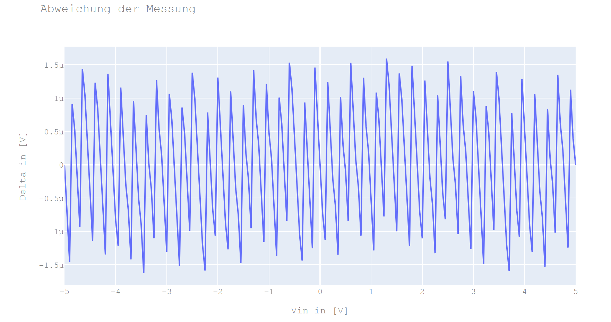

# Multi-Slope-ADC-Jupyter
Simulation eines Multi-Slope ADC (20 Bit)

Um die Funktionsweise eines Multi-Slope ADC besser zu verstehen, habe ich eine Simulation mit Jupyter Lab in Python geschrieben. 
Die Version ist noch etwas rudimentär, jedoch lassen sich schon unterschiedliche Wave-Formen und unterschiedliche Fehlerquellen simulieren. 
Mit der Simulation kann gezeigt werden, welche Fehlerquellen ein lineares oder nicht lineares Verhalten haben.

Die RunUp-Phase besteht aktuell aus 3250 Zyklen in den der Integrator geladen wird mit eine Rampelänge von 320 Implusen. Hieraus ergibt sich einen COUNT von 3250 x 320 = 1.040.000 und somit eine theoretische Auflösung von 10V/1.040.000 = ca. 10uV

Der Messzyklus bei einer Taskfrequenz von 10 Mhz (100ns) ist somit ca. 100 ms

Die Simulation unterscheidet grundsätzlich zwei Formen der RunDown-Phase. Einmal eine Zeitmessung nach der RunUp-Phase oder eine Restwert-Messung über einen Residual-ADC nach der RunUp-Phase.

Die Darstellung der folgenden Diagramme basiert auf der Verwendung eines 12 bit Resudual ADC's für die Messung der Restspannung nach der RunUp-Phase.

Eine gute Einführung in das Thema [Multi-Slope ADC](https://en.wikipedia.org/wiki/Integrating_ADC) gibt es auf Wikipedia

# Linearität
In der Simulation wird für die Betrachtung der Linearität eine Eingangsspannung Vin von -5.0V bis +5.0V in 0.5 V Schritten durchlaufen.

## Ideal-Fall mit RunDown (Zeitmessung)
Wenn wir die Eingangswiderstände (Rin, Rref+ und Rref-) und die Vref Spannungen als ideal annehmen, bekommen wir folgende Anweichung. ToDo Formel für Vin nochmal kontrollieren, da wir eine Abweichung von 30uV haben.

integrator.VrefN = -7.04480  
integrator.VrefP = 7.04480  
integrator.ChargingInjection = 0.000  

integrator.R_Vin   = 200.0 # k  
integrator.R_VrefN = 100.0 # k  
integrator.R_VrefP = 100.0 # k  

## Real-Fall mit RunDown (Zeitmessung)
Da wir in der Realität jedoch Abweichungen in dem Widerständs-Array und in der +/-Vref-Spannung bekommen, erhalten wir eine lineare Abweichung. Selbst kleine unterschiede in den Widerständs-Array und +/-Vref-Spannungen führen zur einer linearen Abweichung.

Beispiel:

**integrator.VrefN = -7.04580**  
integrator.VrefP = 7.04480  
integrator.ChargingInjection = 0.000  

integrator.R_Vin   = 50.0 # k  
**integrator.R_VrefN = 50.01 # k**  
integrator.R_VrefP = 50.00 # k  

## Mögliche Lösungen 
### 1. Präzise Widerstände mit geringer Toleranz verwenden

Der einfachste Ansatz ist, hochwertige Widerstände mit geringen Toleranzen (z. B. 0,01 % oder besser) und niedrigem Temperaturkoeffizienten (< 10 ppm/∘C) zu verwenden. Dies reduziert die Fehlanpassung auf ein Minimum.

Vorteil: Einfach und kostengünstig bei geringer Fehlanpassung.  
Nachteil: Physische Grenzen durch Bauteiltoleranzen.  

### 2. Präzise Spannungsreferenz z.B. LM399

Auch hier muß bei der Erzeugung der negativen Spannung -Vref ein möglichs präzises Widerstands-Array verwendet werden.

### 3. Digitale Kalibrierung (empfohlen bei hochgenauen ADCs)

Digitale Kalibrierung bietet eine flexible Möglichkeit, die Fehlanpassung der Eingangswiderstände zu korrigieren. Dabei wird das Verhalten des Systems gemessen und die Abweichungen durch Software kompensiert.

Vorgehen:
Messung des Fehlers:

Einspeisen einer bekannten Spannung (𝑉cal) mit positivem und negativem Eingang.
Den systematischen Unterschied zwischen den gemessenen und relaen Wert ermitteln und gespeichert.

## Real-Fall mit RunDown (Zeitmessung) und Kalibierung

Habe die Kalibrierung einmal in die Simulation eingbaut. Es kann gezeigt werden, dass der lineare Fehler verschwindet.

## Realer Fall mit Charging-Injection

Wir müssen uns bei einem Multi-Slope ADC nicht nur mit linearen Fehlern sondern auch mit nicht linearen Fehlern beschäftigen. Die verwendeten Analogen-Schalter haben eine Eigenschaft die als **Charging-Injection** bezeichnet wird. Diese nicht gewollte Eigenschaft führt zu einem nicht linearen Fehler. In der Simulation kann auch dieser Fall betrachtet werden.

## Mögliche Lösung Charging-Injection

Dieses Problem ist relativ einfach zu verstehen. Druch die unterschiedliche Anzahl der Schalterbewegung in der RunUp-Phase Vref+ und Vref- kommt es zu einer Addition einer parasitären Kapazität der Schalter in den Signalpath. 

### 1. Analoge-Schalter mit geringer Charging Injection
Bei einem Hardware-Design sollte also ein Analoge-Schalter mit geringer Charging Injection verwendet werden z.B. ADG1211.

### 2. Software-Kompensation
Wir müssen also erreichen, dass die Schalter Vref+ und Vref- gleichmäßig betätigt werden. 
Die Idee ist nach dem Lesen des Komperators den Schalter einmal, für einen kurzen Zeitraum, in die verkehrte Richtung zu bewegen und dann erst auf die richtige Richtung einzuschwenken, damit sollten die Schalter synchron laufen.
Das untere Bild zeigt einmal diese Waveform (nur 20 Zyklen):

