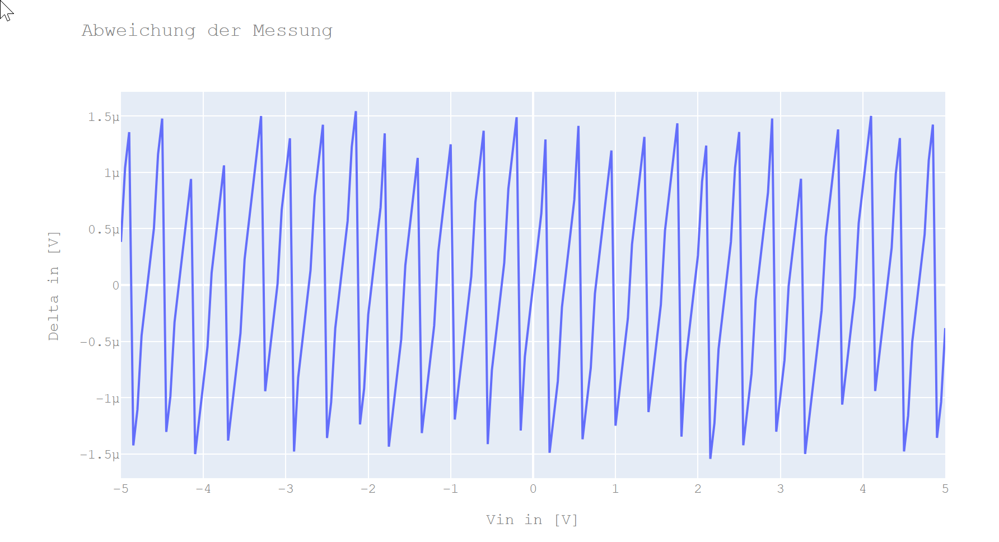

# Multi-Slope-ADC-Jupyter
Simulation eines Multi-Slope ADC

Um die Funktionsweise eines Multi-Slope ADC besser zu verstehen, habe ich eine Simulation mit Jupyter Lab in Python geschrieben. 
Die Version ist noch etwas rudimentär, jedoch lassen sich schon unterschiedliche Wave-Formen und unterschiedliche Fehlerquellen simulieren. 
Mit der Simulation kann gezeigt werden, welche Fehlerquellen ein lineares oder nicht lineares Verhalten haben.

# Linearität

## Ideal
Wenn wir die Eingangswiderstände (Rin, Rref+ und Rref-) und die Vref Spannungen als ideal annehmen, bekommen wir folgende Anweichung.

integrator.VrefN = -7.04480
integrator.VrefP = 7.04480
integrator.ChargingInjection = 0.000

integrator.R_Vin   = 50.0 # k
integrator.R_VrefN = 50.0 # k
integrator.R_VrefP = 50.0 # k

## Real

